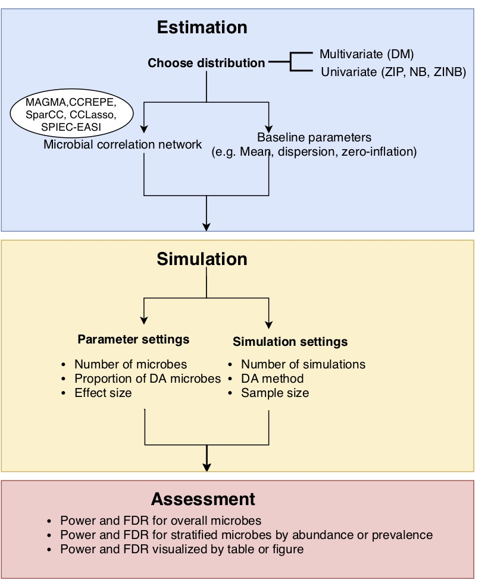
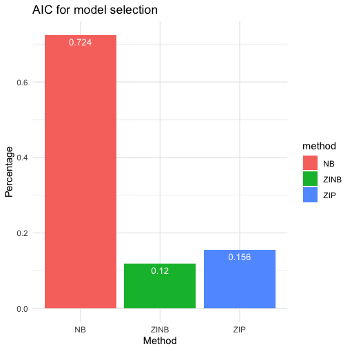
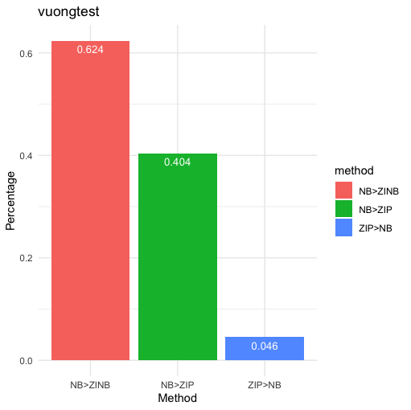

```{r setup, include=FALSE}
knitr::opts_chunk$set(echo = TRUE)
```

## Abstract

Power analysis is essential to decide the sample size of metagenomic sequencing experiments in a case-control study for identifying differentially abundant microbes. However, the complexity of microbiome data characteristics such as excessive zeros, over-dispersion, compositional effect, intrinsically microbial correlations and variable sequencing depths makes the power analysis particularly challenging as the analytical form is usually unavailable. Here, we develop a simulation-based strategy and R package **powmic** to estimate the empirical statistical power while considering the complexity of data characteristics. Finally, a real data example demonstrates the usage of **powmic**. The R package **powmic** is available at <https://github.com/lichen-lab/powmic>.


## Preparations for dependent software packages

1. Install R packages for infeerring microbial correlation network
```{r block1, echo=TRUE,eval=FALSE}
#MAGMA
library(devtools)
install_gitlab("arcgl/rmagma")
library(rMAGMA)

#CCREPE
if (!requireNamespace("BiocManager", quietly = TRUE))
    install.packages("BiocManager")
BiocManager::install("ccrepe")

#SpiecEasi
library(devtools)
install_github("zdk123/SpiecEasi")
```

2. Install other dependent R packages
```{r block2, echo=TRUE,eval=FALSE}
BiocManager::install(c("biomformat","edgeR","DESeq2"))
install.packages(c('ggplot2','gridExtra','lattice','reshape2','MASS','dirmult','nonnest2'))
```

3. Install **powmic**
```{r block3, echo=TRUE,eval=FALSE}
install.packages("devtools")
library(devtools)
install_github("lichen-lab/powmic")
```

## Overview of **powmic**


{width=75%}


## Estimation module

### Choose real dataset

The real dataset is chosen to match the study to be conducted as much as possible. Similar study, which matches the prospective study, can be found from large-scale public database such as Qiita <https://qiita.ucsd.edu/>. Qiita is such as database that integrates processed microbiome data of multiple metagenomic studies. The samples of each study are processed by QIIME [@QIIME], resulting in biom file and sample metadata file. The biom file contains the mapped raw OTU counts for each sample and metadata file contains the information of samples such as age, sex, trait, disease, body site, geography, etc. Users can locate the matched dataset by comparing the meta information between studies in Qiita and prospective study. 

Importantly, Importantly, Qiita also collects data from large-scale microbiome consortium including Human Micro- biome Project (HMP) <https://qiita.ucsd.edu/study/description/1928>, American Gut Project (AGP) <https://qiita.ucsd.edu/study/description/2639> and Earth Microbiome Project (EMP) <https://qiita.ucsd.edu/emp/study/list/>. Specifically, HMP collects ex- tensive 16S rRNA marker-gene sequencing data for the human microbiome from 18 body sites. If human microbiome is of interest, HMP is a resource to estimate parameters for the prospective study in the same or similar human body site. If evolutionary and ecological studies are of interest, EMP is a resource to estimate parameters for the prospective study related to free-living (e.g. water, sediment, surface, soil, hypersaline) and host-associated microbiome (e.g. animal and plant).

The matched real dataset can be obtained in most cases considering the large-scale microbiome studies are accumulated and deposited into Qiita. If the exactly matched real dataset cannot be found, we will use a real dataset approximated to the prospective study by matching sample meta information.


### Choose data distribution

**powmic** offers an interface to choose either multivariate or univariate data generative distributions, based on which parameters can be estimated from real datasets and synthetic datasets can be generated in the simulation.

* Multivariate distribution: DM assumes that underlying microbe proportions follow a multivariate Dirichlet distribution with a constant dispersion parameter. In other way, it allows the variability of sample-wise underlying microbe proportions. Thus, DM improves the fit for over-dispersed data compared to the multinomial distribution, which assumes that sample-wise underlying microbe proportions are the same.
* Univariate distribution: Different from DM, NB, ZINB and ZIP model each microbe individually with different sets of baseline parameters. Beside underlying mean abundance $\mu$, NB includes dispersion $\phi$ for over-dispersed data, while ZIP includes excessive zero probability $p$ for less-dispersed but zero-inflated data, and ZINB contains both $\phi$ and $p$ for over-dispersed and zero-inflated data.

Generally, **powmic** will choose NB with consideration of microbial correlations as the default data distribution. If the data is highly sparse and over-dispersed, ZINB with consideration of microbial correlations is the choice. If the data is highly sparse but less dispersed, ZIP with consideration of microbial correlations is the choice. Specifically, we use two criteria to select the data distribution for the current study:

* Akaike information criterion (AIC): AIC measures the trade-off between the goodness of fit of the model and the simplicity of the model. AIC is defined as 2$k$-2ln($\hat{L}$), where $k$ is the number of estimated parameters in the model and $\hat{L}$ is the maximum value of the likelihood function for the model. Smaller AIC indicates a better model fit. Specifically, powmic fits all distributions to each microbe, identify the distribution with smallest AIC and select the distribution with overall largest proportion of smallest AIC among all microbes.

* Vuong test: Vuong test is a likelihood-ratio-based test for model selection using the Kullback–Leibler information criterion [@vuongtest]. The test compares two models, which can be nested, non-nested or overlapping. For vuongtest function in nonnest2 R package <https://cran.r-project.org/web/packages/nonnest2/>, the usage of Vuong test is vuongtest(Model 1,Model 2), where $H_{0}$: Model 1 fits as well as Model 2; $H_{1}$: Model 1 fits better than Model 2. For each microbe, we compare Model 1 vs Model 2 and vice versa to conclude whether Model 1 is significantly better than Model 2 or vice versa (pvalue$<$0.05). Eventually, powmic will identify the distribution, which is significantly better than other distributions among all microbes.

We choose the data distribution based on both AIC and Vuong test.

### Estimate parameters

**powmic** can estimate parameters for the chosen data distribution. For univariate distributions, powmic can also estimate microbial correlations using either correlation-based approaches such as CCREPE [@CCREPE], SparCC [@SparCC] and CCLasso [@CCLasso] or graph model-based approaches such as SPIEC-EASI [@SPIEC-EASI] and MAGMA [@MAGMA]. Unlike correlation-based approaches that estimate microbial correlations directly, graphical model-based approaches infer an underlying graphical model for compositional data using the conditional independence. By default, **powmic** uses MAGMA, a copula gaussian graphical model combined with GLM marginal distributions. MAGMA holds several advantages compared to other approaches. Compared to correlation-based approaches, it may reduce the possibility of spurious results. Compared to SPIEC-EASI, it considers the structure of microbiome data involving sparsity, over-dispersion and compositionality.


## Simulation module

### Data simulation
Data parameters such as number of microbes, proportion of DA microbes and effect size can also be estimated from the real dataset or be specified based on prior knowledge. To maintain microbial correlations, powmic employs the normal-copula functions to generate the microbe abundance. Let $n$ samples are profiled with $p$ microbes. First, correlated multivariate normal data is generated as $\boldsymbol{Z}_{n \times p} \sim MVN(0, \boldsymbol{\Sigma}_{p \times p})$, where $\boldsymbol{\Sigma}$ is the correlation matrix reflecting pairwise microbial correlations. Second, $\boldsymbol{Z}$ is transformed to the copula space via $\boldsymbol{C}_{n \times p}=\Phi(\boldsymbol{Z})$, where $\Phi$ is the cumulative distribution function (CDF) of the standard normal distribution. Last, correlated data in each sample is generated as $\boldsymbol{X}_{ij}=\boldsymbol{F}_{ij}^{-1}(\boldsymbol{C}_{ij} | \Theta_{j})$, where $\boldsymbol{F}_{ij}^{-1}$ is an inverse CDF of data distribution for $i$th sample and $j$th microbe, and $\Theta_{j}$ is the estimated parameters for $j$th microbe. 


### Power assessment
**powmic** provides an interface of both parametric and nonparametric DA methods. Parametric methods include NB-based edgeR [@edgeR], DESeq2 [@DESeq2] and ZIG-based metagenomeSeq [@metagenomeSeq]. Nonparametric method is Wilcoxon rank-sum test, which is independent of any distribution assumption. Multiple synthetic datasets are simulated for a given sample size and power assessment is performed on each dataset. Given a nominal level of FDR, average power evaluation metrics such as True Positive Rate (TPR=$\frac{TP}{TP+FN}$) and False Discovery Rate (FDR=$\frac{FP}{max(1, FP+TP)}$) are reported. Besides the global power assessment for all microbes, powmic also performs the power assessment for microbes in stratums, where microbes are stratified by the prevalence or abundance.


## One real data example to demonstrate the workflow of **powmic**

If gut microbiome are of interest, we download COMBO dataset from Qiita with study ID 1011 (https://qiita.ucsd.edu/study/description/1011).

```{r download, echo=TRUE,eval=TRUE,warning=FALSE,message=FALSE}
# Process COMBO dataset
library(powmic)
Sys.setlocale('LC_ALL','C')
data=read_biom('study_1011_012820-210610/processed_data/221_otu_table.biom')
otu_table=as.data.frame(as.matrix(biom_data(data)))
dim(otu_table)
meta=read.table('1011_20171108-091205.txt',header=T,sep="\t",stringsAsFactors = F,quote=NULL, comment='')
tread=colSums(otu_table)
nonzeros=rowSums(otu_table!=0)
otu.mat=otu_table[nonzeros>5,]
dim(otu.mat)

# DE analysis for obtaining proportion of DA otus and lfc between male and female
id=match(colnames(otu.mat),meta$sample_name)
sex=meta$sex[id]; table(sex)

dat=list()
dat$counts=otu.mat
dat$designs=numeric(length(sex))
dat$designs[which(sex=='female')]=1
d=DGEList(counts=dat$counts, group=dat$designs)
d=calcNormFactors(d)
d=estimateCommonDisp(d)
d=estimateTagwiseDisp(d)
fit=exactTest(d)
res=topTags(fit, n=nrow(dat$counts))
res=as.data.frame(res)
proportion=sum(res$FDR<0.1)/nrow(dat$counts)
proportion
lfc=res$logFC[res$FDR<0.1]
hist(lfc)
```

There are 100 samples (56 female and 44 male) and 3393 OTUs. After removing OTUs with less than 5 non-zero entries across samples, we have 1379 OTUs for the downstream analysis. In a two-group design (female vs male), we use edgeR to obtain the proportion of DA OTUs and effect size (fold change). There are around 3\% DA OTUs (FDR<0.1) and the fold changes are shown in the figure below.

We apply two model selection criteria to choose the data distribution. We start with AIC first.
```{r AIC, echo=TRUE,eval=FALSE,warning=FALSE,message=FALSE}
modelselect.AIC(t(otu.mat))
```
{width=65%}

NB acheives 72.4\% smallest AIC for all OTUs.

**powmic** further compares NB, ZINB and ZIP using Vuong test.

```{r vuong, echo=TRUE,eval=FALSE,warning=FALSE,message=FALSE}
modelselect.vuong(t(otu.mat))
```
{width=65%}

Comparing NB and ZINB, NB is 62.2\% better than ZINB. Comparing NB and ZIP, NB is 40.2\% better than ZIP and ZIP is only 4.6\% better than NB. Overall, we choose NB as the data distribution based on both AIC and Vuong test.

**powmic** then estimates parameters including microbial correlations, mean and dispersion for all OTUs. The estimation steps will be much longer if microbial correlations needs to be estimated.

```{r estimation, echo=TRUE,eval=FALSE}
library(rMAGMA)
#fit NB
params=list()
Sigma=estSigma(x,method='MAGMA',distrib='NB') #option for estimating microbial correlation structure
params$Sigma=Sigma
out=fit.NB(x)
params$otu.mat=out$otu.mat
params$mu=out$mu
params$phi=out$phi
```

We set 5\% DA OTUs and use previous estimated parameters from COMBO study to generate synthetic datasets and perform power analysis.

```{r simulation, echo=TRUE,eval=TRUE}
data(params2) #params has been built into the package
lmu0=log(params$mu)
lphi0=log(params$phi)
Sigma=params$Sigma
distrib='NB'
lfc.mu=lfc
params.sim=setParams.NB(nTaxa=1000,p.DA=0.05,Sigma=Sigma,lmu0=lmu0,lphi0=lphi0,lfc.mu=lfc)
powmic.out=powmic(n1s=c(20,60), n2s=c(20,60),
                  params=params.sim,distrib=distrib,DAmethod='wilcox',nsims = 2)
```


```{r assessment, echo=TRUE,eval=TRUE}
assess.out = assess(powmic.out, alpha.type='fdr',alpha.level=0.1,stratify.type='prevalence')
sum.out=summaryAssess(assess.out,assess.type='overall')
```

<!-- ```{r visualize, echo=TRUE,eval=FALSE,message=FALSE} -->
<!-- p1 = plotStrata(assess.out, "power", stratify.by = 'prevalence',  -->
<!--                 is.legend = F) -->
<!-- p2 = plotStrata(assess.out, "fdr", stratify.by = 'prevalence',  -->
<!--                 is.legend = F) -->
<!-- grid.arrange(p1, p2, nrow = 1) -->
<!-- ``` -->


# References